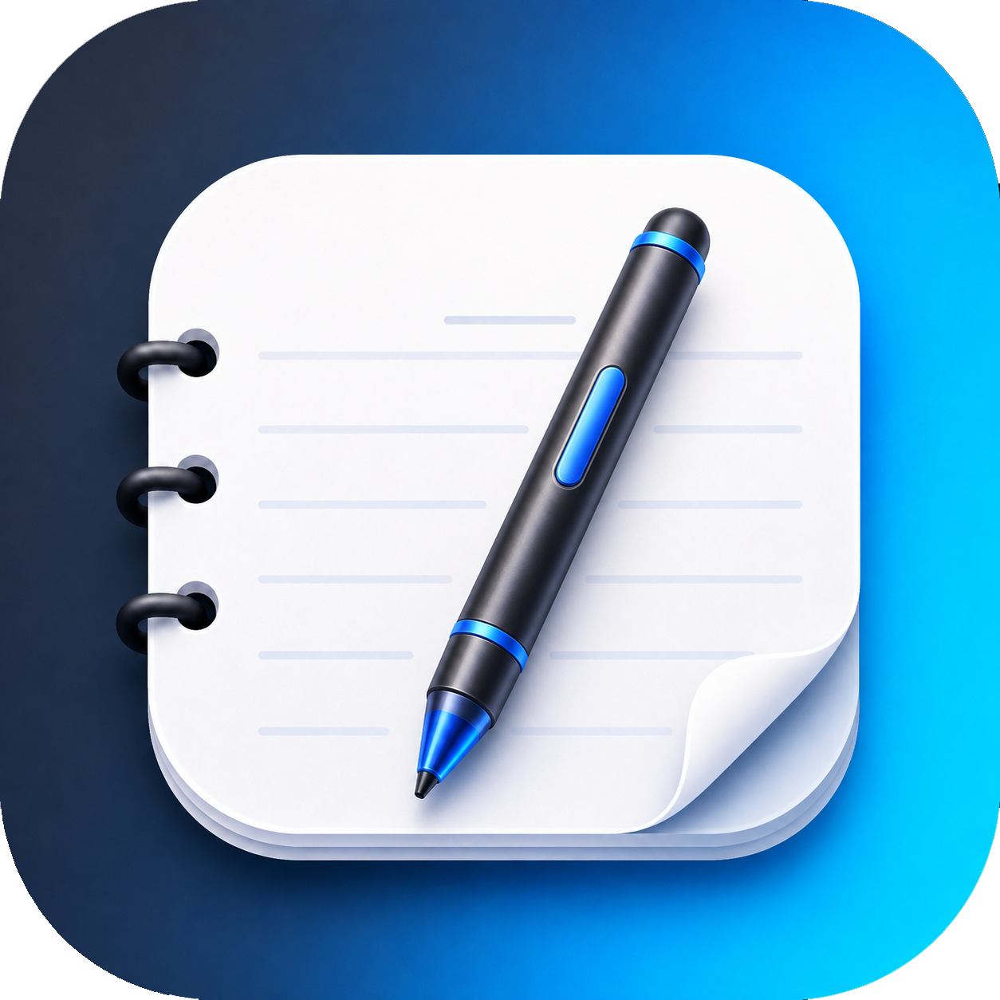

<a href='#acidburnmonkey'> 

# Vive Notes Desktop

A handwritten note-taking app built for students, combining the natural feel of pen and paper with the power
of digital documents.

All features are completely free, including cross-device sync. Your notes stay private: no data leaves your device,
and all AI features run entirely on-device.

[Demo Video](https://youtu.be/QZ6rd2uQD9E)

# Self Host server

[Sync Server](https://github.com/AquilaIgnis/viveCServer)

# Build from source

## Desktop

Use a current JDK with `jpackage` available (JDK 25 is recommended).

The default on linux is wayland

```bash
./gradlew :desktopApp:run
./gradlew :shared:jvmTest
```

Force x11 backed

```bash
:desktopApp:run --args='--x11'
```

Compose hot reload:

```bash
./gradlew :desktopApp:hotRun --auto
```

## Wasm

```bash
./gradlew wasmJsBrowserDevelopmentRun
```
